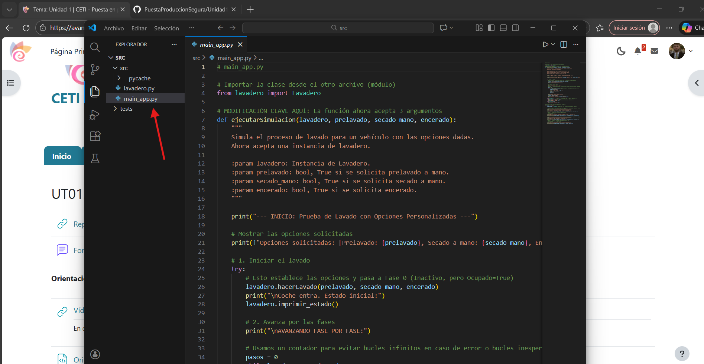
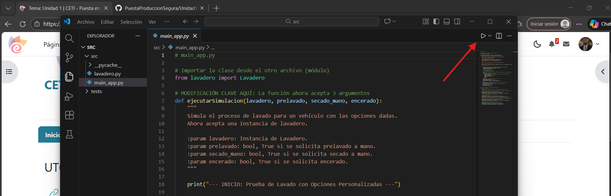
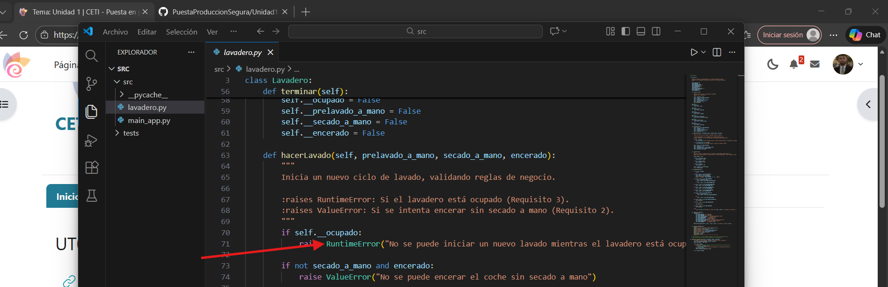
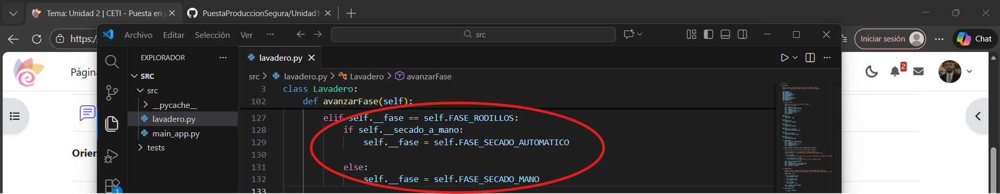
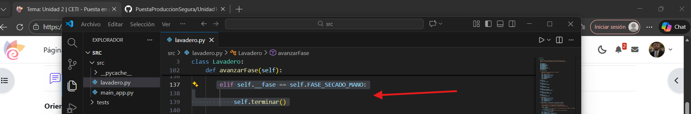

# En esta sección. lo que vamos a realizar es la depuración del código y la ejecución del mismo, de esta forma, podremos observar sus errores y corregirlos.

El primer paso será abrir el Visual Studio Code. Una vez dentro, seleccionaremos la carpeta donde se encuentra la app:

Una vez abierta la carpeta donde se encuentra la app, la cual es ***main_app.py***, lo que haremos será ejecutarla, para ello, clickamos en el boton de play situado en la esquina superior derecha:

Pero antes de ejecutarlo, lo que debemos hacer es leer las premisas con las cuales se ha diseñado la app, y corregir los errores que encontremos en el código, debido a que si ejecutamos la app así, nos saldrá un error bastante rápido. 

Por lo tanto, lo que vamos a hacer es corregir los errores, y después, probaremos a ejecutar la app a ver si todo funciona correctamente:

----

- **Error 1: RuntimeError**
  
    

   Como podemos observar, aparece un RuntimeError cuando el lavadero está ocupado, mientras las premisas con las cuales se crearon la app nos indica: *Cuando se
   intenta hacer un lavado mientras que otro ya está en marcha, se produce una ValueError*.

   Para corregir este error, simplemente cambiamos ***RuntimeError*** por ***ValueError***:
  
   

  ----
  
-  **Error 2: Error en tarifas de secado a mano y encerado**

   Según las premisas del enunciado del ejercicio, la suma de **lavado + secado a mano** reportaría al lavadero unas ganancias de **6€**, si a esto le añadimos
   **encerado**, sería un total de **7,20€**.

   Esto quiere decir que el precio del **secado a mano** debe ser de **1€**, mientras que el del **encerado** debe ser de **1,20€**.

   El error está en que en el código, las tarifas vienen al revés, costando **1,20€** el **secado a mano** y **1€** el **encerado**:

   

   Para corregir este error, simplemente lo que haremos será cambiar estos valores, como antes he mencionado, el valor del secado a mano le corresponde al valor
   del encerado y viceversa:

   

----

-  **Error 3: Error de lógica en fase de secado a mano y automático**

   En el código, aparece un error en la transición de una fase a otra. Según el código, cuando estamos en la ***fase de rodillos***, si seleccionamos ***secado a
   mano***, nos lleva a ***secado automático***. Esto en ningún caso debería de ser así, puesto que si seleccionamos ***secado a mano***, deberíamos ir a
   ***secado
   a mano***:

   

   Para solucionar esto, cambiaremos la parte donde se encuentra ***self.__fase = self.FASE_SECADO_AUTOMATICO*** y la pondremos donde está el ***self.__fase =
   self.FASE_SECADO_MANO***:

   

----

-  **Error 4: Interrupción hacia el encerado**

   Como podemos observar en el código proporcionado, siempre que seleccionamos ***secado a mano***, se llama a ***terminar***. Esto no debería ser así, ya que nos
   debería dar opción a pasar al ***encerado***:

   

   Para solucionarlo, debemos añadir la opción de que nos deje acceder a la fase 8, la cual es ***encerado***:

   

----
  
-  **Error 5: Función ***ejecutar_y_obtener_fases*** está fuera de la clase**

   Aunque como menciona el código, esta función no es parte del lavadero real, aún así, no se encuentra identada a la clase. ¿Qué problema ocasionará esto? Pues
   Que al usar ***self***, el intérprete fallará porque no la reconoce como parte de **Lavadero**:

   

   Para solucionar esto, debemos mover el bloque hacia la derecha para que coincida con la identación de la clase:

  
   Como podemos observar, ahora sí se encuentra bien identado y será reconocible.

