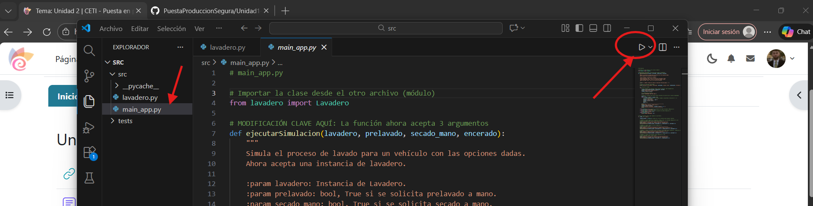
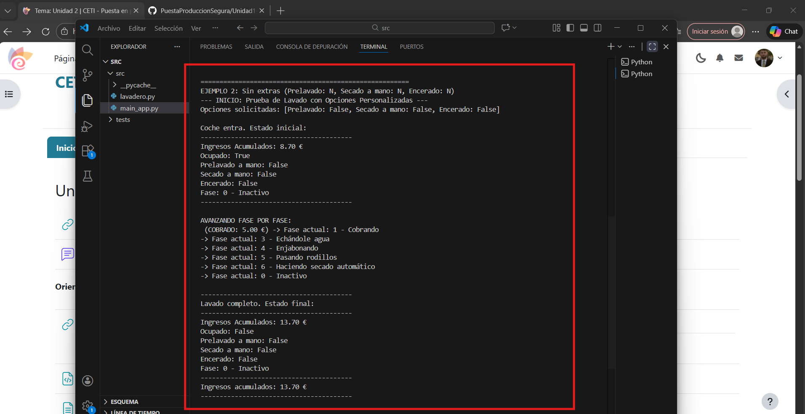
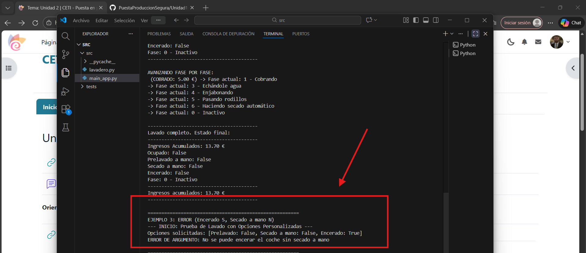

# En esta sección. lo que vamos a realizar es la depuración del código y la ejecución del mismo, de esta forma, podremos observar sus errores y corregirlos.

El primer paso será abrir el Visual Studio Code. Una vez dentro, seleccionaremos la carpeta donde se encuentra la app:

Una vez abierta la carpeta donde se encuentra la app, la cual es ***main_app.py***, lo que haremos será ejecutarla, para ello, clickamos en el boton de play situado en la esquina superior derecha:

Pero antes de ejecutarlo, lo que debemos hacer es leer las premisas con las cuales se ha diseñado la app, y corregir los errores que encontremos en el código, debido a que si ejecutamos la app así, nos saldrá un error bastante rápido. 

## Solución de errores:

Por lo tanto, lo que vamos a hacer es corregir los errores, y después, probaremos a ejecutar la app a ver si todo funciona correctamente:

----

- **Error 1: RuntimeError**
  
    

   Como podemos observar, aparece un RuntimeError cuando el lavadero está ocupado, mientras las premisas con las cuales se crearon la app nos indica: *Cuando se
   intenta hacer un lavado mientras que otro ya está en marcha, se produce una ValueError*.

   Para corregir este error, simplemente cambiamos ***RuntimeError*** por ***ValueError***:
  
   

  ----
  
-  **Error 2: Error en tarifas de secado a mano y encerado**

   Según las premisas del enunciado del ejercicio, la suma de **lavado + secado a mano** reportaría al lavadero unas ganancias de **6€**, si a esto le añadimos
   **encerado**, sería un total de **7,20€**.

   Esto quiere decir que el precio del **secado a mano** debe ser de **1€**, mientras que el del **encerado** debe ser de **1,20€**.

   El error está en que en el código, las tarifas vienen al revés, costando **1,20€** el **secado a mano** y **1€** el **encerado**:

   

   Para corregir este error, simplemente lo que haremos será cambiar estos valores, como antes he mencionado, el valor del secado a mano le corresponde al valor
   del encerado y viceversa:

   

----

-  **Error 3: Error de lógica en fase de secado a mano y automático**

   En el código, aparece un error en la transición de una fase a otra. Según el código, cuando estamos en la ***fase de rodillos***, si seleccionamos ***secado a
   mano***, nos lleva a ***secado automático***. Esto en ningún caso debería de ser así, puesto que si seleccionamos ***secado a mano***, deberíamos ir a
   ***secado
   a mano***:

   

   Para solucionar esto, cambiaremos la parte donde se encuentra ***self.__fase = self.FASE_SECADO_AUTOMATICO*** y la pondremos donde está el ***self.__fase =
   self.FASE_SECADO_MANO***:

   

----

-  **Error 4: Interrupción hacia el encerado**

   Como podemos observar en el código proporcionado, siempre que seleccionamos ***secado a mano***, se llama a ***terminar***. Esto no debería ser así, ya que nos
   debería dar opción a pasar al ***encerado***:

   

   Para solucionarlo, debemos añadir la opción de que nos deje acceder a la fase 8, la cual es ***encerado***:

   

----
  
-  **Error 5: Función ***ejecutar_y_obtener_fases*** está fuera de la clase**

   Aunque como menciona el código, esta función no es parte del lavadero real, aún así, no se encuentra identada a la clase. ¿Qué problema ocasionará esto? Pues
   Que al usar ***self***, el intérprete fallará porque no la reconoce como parte de **Lavadero**:

   

   Para solucionar esto, debemos mover el bloque hacia la derecha para que coincida con la identación de la clase:

   
  
  
   Como podemos observar, ahora sí se encuentra bien identado y será reconocible.

----

-  **Error 6: Referencia a Método Inexistente**

   En este mismo bloque de código que acabamos de corregir, se hace referencia a un módulo que no existe, el cual es ***_hacer_lavado***. Este módulo es
   incorrecto, el módulo correcto sería ***hacerLavado***:

   

   Para corregirlo, simplemente lo cambiamos a ***hacerLavado***

   

## Ejecución del código

  Con las correcciones ya hechas, podemos pasar a ejecutar el código, a ver si nos proporciona fallos. Para ello, debemos ir al ***main_app.py***, el cual
  ejecutará la aplicación basándose en el código de ***Lavadero***. Después, haremos click en el botón de play situado en la esquina derecha superior de Visual:

  
  

  Una vez ejecutado, podemos observar 3 cosas. Vamos por partes:

  1. Éxito en la Lógica de Negocio (Ejemplos 1 y 2)

     **Ejemplo 1 (Todo incluido):** Ha pasado por las fases 0, 1, 2, 3, 4, 5, 7, 8, 0. Los ingresos han sido 8.70 €. Esto coincide exactamente con las premisas
     del enunciado (5.00 base + 1.50 prelavado + 1.00 secado + 1.20 encerado).

     **Ejemplo 2 (Sin extras):** Ha pasado por 0, 1, 3, 4, 5, 6, 0. Ha saltado la fase 2 (prelavado) y la fase 7-8 (manual/encerado), yendo directo a la 6
     (automático). Los ingresos acumulados subieron a 13.70 € (8.70 + 5.00). Esto quiere decir que la acumulación funciona.

     
     
     

----

  2. Validación de Errores (Ejemplo 3)
     
     El programa ha detectado que el cliente quería encerado sin secado a mano y ha lanzado el ValueError con el mensaje: "No se puede encerar el coche sin
     secado a mano". Esto demuestra que la corrección que hemos hecho con anterioridad al RuntimeError es correcta y lanza el mensaje correcto.

     

----

  3. El error de Python (Ejemplo 4)
     Inesperadamente, el programa se ha detenido por un TypeError. Python nos señala: missing 1 required positional argument: 'encerado' Esto puede deberse a un
     error en el main_app.py, el cual no hemos comprobado antes de ejecutarlo.
     

     

     Echando un vistazo al main_app.py, parece ser que sucede porque la función
     ejecutarSimulacion espera 4 cosas y el ejemplo 4 solo le da 3. Habría que corregir la siguiente línea del main_app.py:

     

     Parece ser que está definido así: ***def ejecutarSimulacion(lavadero, prelavado, secado_mano, encerado):***

     Esto quiere decir que se nos obliga a proporcionarle 4 argumentos sí o sí, pero en el Ejemplo 4 sólo sxe proporcionan 3, ya que ***encerado=false***. Por lo
     tanto, va a dar un error ya que se queda esperando a dicho argumento.

     Para solucionar esto, lo que haremos es modificar dicha línea, especificando que encerado también puede ser ***false***:

      

     

     

