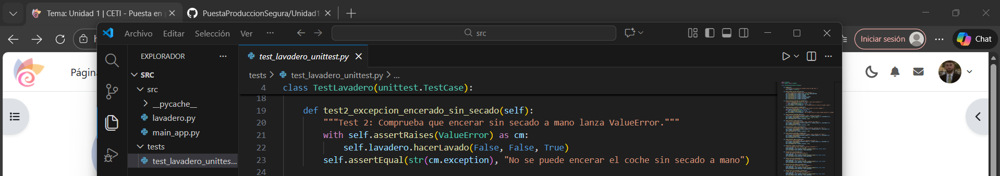
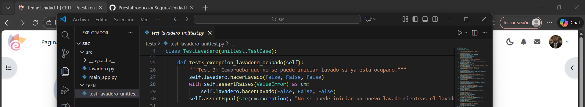
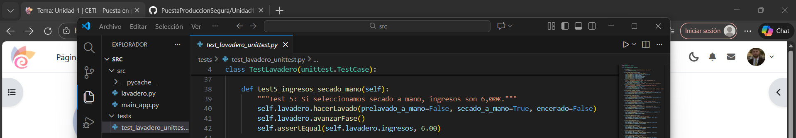
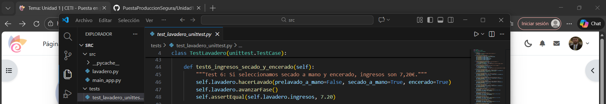
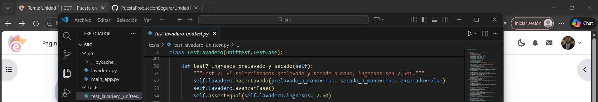
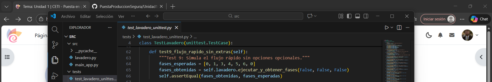
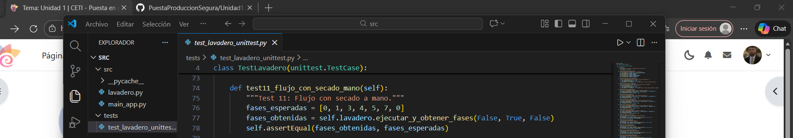
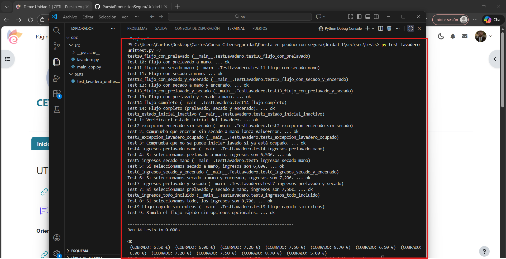

# En este apartado, lo que vamos a realizar es una serie de test basándonos en el enunciado de la tarea, el cual nos menciona una serie de 14 pruebas.

En la carpeta proporcionada en la tarea, se nos proporciona un ejemplo de test, pero este no nos servirá de mucho, simplemente para fijarnos en como desarrollar
más o menos las pruebas.

Se nos menciona que el código contiene errores, pero estos errores ya los hemos solucionado previamente, lo cual quiere decir que las pruebas no deberían arrojar
ni un solo error, por lo que dichas pruebas nos van a servir para comprobar que el código está perfectamente estructurado.

----

## 14 test basándonos en los enunciados

**1. Cuando se crea un lavadero, éste no tiene ingresos, no está ocupado, está en fase 0 y todas las opciones de lavado
   (prelavado a mano, secado a mano y encerado) están puestas a false.**

   

**2. Cuando se intenta comprar un lavado con encerado pero sin secado a mano, se produce una ValueError.**

   

**3. Cuando se intenta hacer un lavado mientras que otro ya está en marcha, se produce una ValueError.**

   

**4.Si seleccionamos un lavado con prelavado a mano, los ingresos de lavadero son 6,50€.**

   

**5.Si seleccionamos un lavado con secado a mano, los ingresos son 6,00€.**

   

**6.Si seleccionamos un lavado con secado a mano y encerado, los ingresos son 7,20€.**

   

**7.Si seleccionamos un lavado con prelavado a mano y secado a mano, los ingresos son 7,50€.**

   

**8.Si seleccionamos un lavado con prelavado a mano, secado a mano y encerado, los ingresos son 8,70€.**

   

**9.Si seleccionamos un lavado sin extras y vamos avanzando fases, el lavadero pasa por las fases 0, 1, 3, 4, 5, 6, 0.**

   

**10.Si seleccionamos un lavado con prelavado a mano y vamos avanzando fases, el lavadero pasa por las fases 0, 1, 2, 3, 4, 5, 6, 0.**

   

**11.Si seleccionamos un lavado con secado a mano y vamos avanzando fases, el lavadero pasa por las fases 0, 1, 3, 4, 5, 7, 0.**

   

**12.Si seleccionamos un lavado con secado a mano y encerado y vamos avanzando fases, el lavadero pasa por las fases 0, 1, 3, 4, 5, 7, 8, 0.**

   

**13.Si seleccionamos un lavado con prelavado a mano y secado a mano y vamos avanzando fases, el lavadero pasa por las fases 0, 1, 2, 3, 4, 5, 7, 0.**

   

**14.Si seleccionamos un lavado con prelavado a mano, secado a mano y encerado y vamos avanzando fases, el lavadero pasa por las fases 0, 1, 2, 3, 4, 5, 7, 8, 0.**

   

----
## Ejecución del test

Como he mencionado antes, vamos a ejecutar el test para verificar que todas las corrwcciones que hemos realizado con anterioridad dan solución a todos los problemas.

Para ejecutarlo, abriremos la consola, y escribiremos ***py test_lavadero_unittest.py -v***:

   

   

