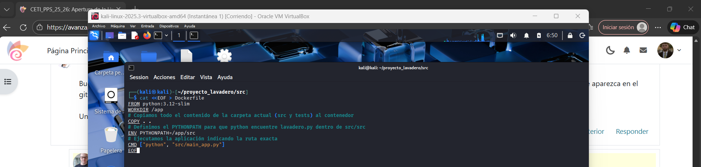

# En este apartado, ejecutaremos el código en una sandbox.

Se utiliza una **Sandbox** para ejecutar una aplicación de forma más segura. Como cualquier programa nuevo puede tener fallos o errores de seguridad, el sandbox
funciona como una “barrera” que limita lo que la aplicación puede hacer. De esta manera, se restringe el acceso al sistema y a los archivos importantes, evitando 
que un posible ataque o fallo afecte al sistema principal de la computadora.

En mi caso, he escogido **Docker**, la cual para esta práctica nos vale como sandbox. Docker permite ejecutar aplicaciones dentro de entornos aislados y controlados.
Cada contenedor incluye la aplicación junto con todas sus dependencias, lo que garantiza que se ejecute de forma consistente independientemente del sistema anfitrión.
Este aislamiento limita el acceso del contenedor a los recursos del sistema, reduciendo los riesgos de seguridad y evitando que una aplicación con fallos o
comportamiento malicioso afecte al sistema principal.

En mi caso, Docker se utilizará sobre un sistema Kali Linux, lo que permite crear y gestionar entornos aislados de manera eficiente para la ejecución de
herramientas o servicios específicos. He elegido Docker porque facilita la creación, despliegue y eliminación de contenedores de forma rápida, sin necesidad de
configuraciones complejas. Además, ofrece un buen equilibrio entre aislamiento, rendimiento y facilidad de uso, lo que lo convierte en una solución adecuada para
implementar medidas de seguridad y pruebas controladas dentro de Kali Linux.

----

## Ejecución en Sandbox

Para ejecutarlo en la sandbox antes mencionada, Docker, simplemente debemos tener instalado Docker, que en caso de Kali, suele venir ya instalado. Después,
habría que crear un Dockerfile en el cual vamos a configurar el contenedor Docker. Una vez configurado el Dockerfile, debemos ejecutar dos simples comandos.

**Dockerfile**

***Una vez creado el Dockerfile, haré uso de los siguientes comandos:***

- **sudo docker build -t lavadero-sandbox .**

  
- **sudo docker run --rm -it lavadero-sandbox**

Como podemos observar, la aplicación se ha ejecutado correctamente en un entorno aislado. En este caso ha sido en un contenedor de Docker, el cual en ningún
momento interactúa con nuestro sistema, lo que nos quiere decir que si existiera alguna vulnerabilidad, únicamente afectaría al contenedor y no a nuestro sistema
real. Esta práctica es muy buena en un entorno de producción, ya que nos proporciona un buen nivel de seguridad.

